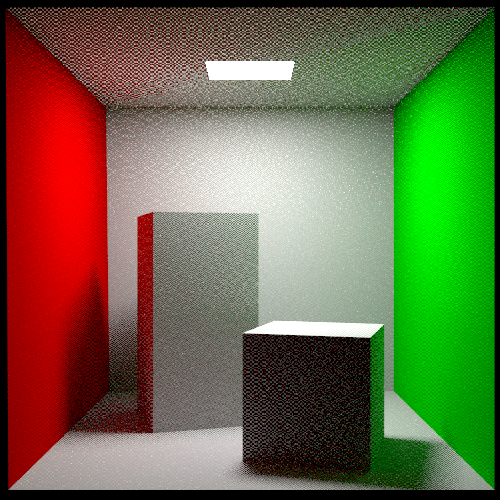
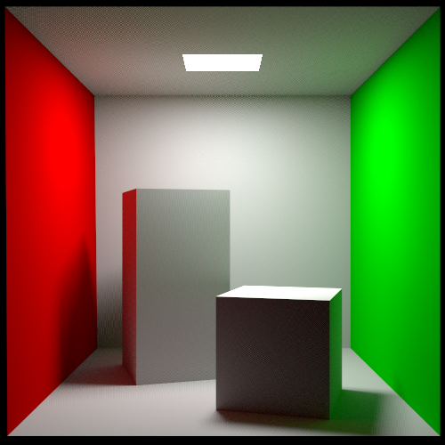
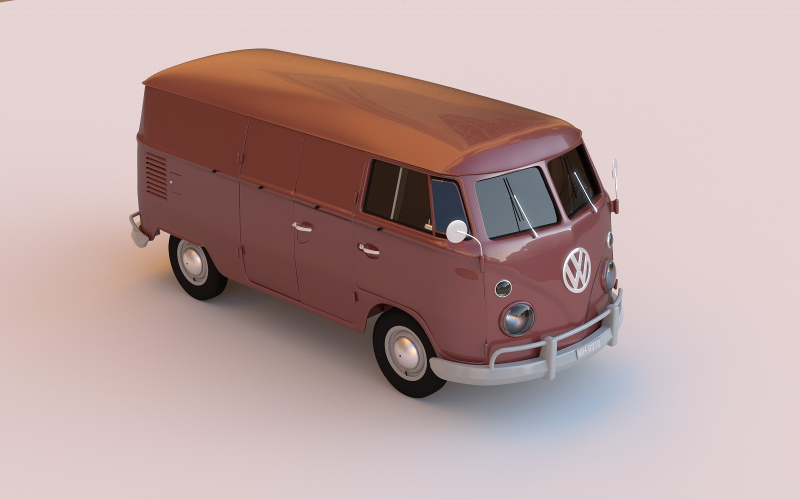

===============
Getting Started
===============

Get Rust
========

First `install Rust`_. To keep it up to date use `rustup`_:

.. code:: shell

          rustup update

Compiling rs_pbrt
=================

Cloning the repository
----------------------

There are two repositories you can get the **Rust source code** from:

1. `GitHub repository`_
2. `Codeberg repository`_

Both should be exactly the same, but reported issues etc. might differ.

GitHub
......

.. code:: shell

          # using SSH
          git clone git@github.com:wahn/rs_pbrt.git
          # or using HTTPS
          git clone https://github.com/wahn/rs_pbrt.git

Codeberg
........

.. code:: shell

          # using SSH
          git clone codeberg@codeberg.org:wahn/rs_pbrt.git
          # or using HTTPS
          git clone https://codeberg.org/wahn/rs_pbrt.git

Use Cargo to compile executables
--------------------------------

.. code:: shell

          # enter repository
          cd rs_pbrt
          # compile without OpenEXR support
          cargo test --release --no-default-features
          # compile executable rs_pbrt (and run it to see options)
          cargo run --release --no-default-features

For a **debug** version compile without the ``--release`` option.

.. code:: shell

          # compile without OpenEXR support
          cargo test --no-default-features
          # compile executable rs_pbrt (and run it to see options)
          cargo run --no-default-features

For more information about **Cargo**, check out `its documentation`_.

The executables can be found in either the **release** or the
**debug** target directory:

.. code:: shell

          # release
          ls ./target/release
          # debug
          ls ./target/debug

Create a local copy of the documentation
========================================

.. code:: shell

          # no OpenEXR support
          cargo doc --no-default-features

Use your favourite `web browser`_ to open the local (Rust source code)
documentation:

.. code:: shell

          firefox target/doc/rs_pbrt/index.html

You can also find the `official documentation`_ (of the latest
release) on the ``rs_pbrt`` web site.

Running the renderer
====================

Without arguments (or by providing the ``-h`` or ``--help`` option)
you get a simple **usage** message of the main executable ``rs_pbrt``:

.. code:: shell

          # relative path to executable rs_pbrt (assuming release build)
          ./target/release/rs_pbrt --help
          # output
          rs_pbrt 0.9.3
          Parse a PBRT scene file (extension .pbrt) and render it
          
          USAGE:
              rs_pbrt [OPTIONS] <path>
          
          FLAGS:
              -h, --help       Prints help information
              -V, --version    Prints version information
          
          OPTIONS:
                  --cropx0 <cropx0>        Specify an image crop window <x0 x1 y0 y1> [default: 0.0]
                  --cropx1 <cropx1>        Specify an image crop window <x0 x1 y0 y1> [default: 1.0]
                  --cropy0 <cropy0>        Specify an image crop window <x0 x1 y0 y1> [default: 0.0]
                  --cropy1 <cropy1>        Specify an image crop window <x0 x1 y0 y1> [default: 1.0]
              -t, --nthreads <nthreads>    use specified number of threads for rendering [default: 0]
              -s, --samples <samples>      pixel samples [default: 0]
          
          ARGS:
              <path>    The path to the file to read

The **version** can be checked by:

.. code:: shell

          # print version number
          ./target/release/rs_pbrt --version
          # output
          rs_pbrt 0.9.3

Your first rendered image
=========================

By specifing an input file (in this case ``cornell_box.pbrt``) you can
render a `PNG`_ image (currently always being called ``pbrt.png``):

.. code:: shell

          # specifing an input file
          ./target/release/rs_pbrt ~/git/gitlab/rs-pbrt-test-scenes/pbrt/cornell_box/cornell_box.pbrt
          # output
          pbrt version 0.9.3 (unknown) [Detected 4 cores]
          Copyright (c) 2016-2021 Jan Douglas Bert Walter.
          Rust code based on C++ code by Matt Pharr, Greg Humphreys, and Wenzel Jakob.
          Film "image"
            "integer xresolution" [500]
            "integer yresolution" [500]
          Sampler "sobol"
            "integer pixelsamples" [8]
          Integrator "path"
          Rendering with 4 thread(s) ...
          1024 / 1024 [=======================================================================] 100.00 % 191.65/s 
          Writing image "pbrt.png" with bounds Bounds2i { p_min: Point2i { x: 0, y: 0 }, p_max: Point2i { x: 500, y: 500 } }

The resulting image should look like this:

If you modify the proper line in ``cornell_box.pbrt`` to use more
**pixel samples** you should end up with a less noisy image, but
rendering will take longer:

.. code:: diff

          diff --git a/assets/scenes/cornell_box.pbrt b/assets/scenes/cornell_box.pbrt
          index aa3a210..559e860 100644
          --- a/assets/scenes/cornell_box.pbrt
          +++ b/assets/scenes/cornell_box.pbrt
          @@ -10,7 +10,7 @@ Film "image"
             "integer yresolution" [ 500 ]
           ##  "integer outlierrejection_k" [ 10 ]
           ##Sampler "sobol"
          -Sampler "sobol" "integer pixelsamples" [8]
          +Sampler "sobol" "integer pixelsamples" [256]
           ##PixelFilter "blackmanharris"
           ##SurfaceIntegrator "bidirectional"
           ##Integrator "directlighting" "integer maxdepth" [10]

Instead of modifying the ``.pbrt`` file you can alternatively specify
the samples per pixel on the command line:

.. code:: shell

           ./target/release/rs_pbrt --samples 256 ~/git/gitlab/rs-pbrt-test-scenes/pbrt/cornell_box/cornell_box.pbrt

More scenes to render
=====================

Because ``rs_pbrt`` isn't 100% compatible to the C++ counter part
(yet) I collect ``.pbrt`` `scene files`_ in a separate repository on
**GitLab**. Have a look at the `Wiki`_ there.

Just clone it to another location:

.. code:: shell

           # using SSH
           git clone git@gitlab.com:jdb-walter/rs-pbrt-test-scenes.git
           # or using HTTPS
           git clone https://gitlab.com/jdb-walter/rs-pbrt-test-scenes.git

That's it, for a quick start ... have fun rendering some of the
provided scenes!

.. _install Rust: https://www.rust-lang.org/tools/install
.. _rustup: https://github.com/rust-lang-nursery/rustup.rs
.. _GitHub repository: https://github.com/wahn/rs_pbrt
.. _Codeberg repository: https://codeberg.org/wahn/rs_pbrt
.. _its documentation: https://doc.rust-lang.org/cargo
.. _web browser: https://en.wikipedia.org/wiki/Web_browser
.. _official documentation: https://www.rs-pbrt.org/doc/crates/rs_pbrt/index.html
.. _PNG: https://en.wikipedia.org/wiki/Portable_Network_Graphics
.. _scene files: https://gitlab.com/jdb-walter/rs-pbrt-test-scenes
.. _Wiki: https://gitlab.com/jdb-walter/rs-pbrt-test-scenes/wikis/home

